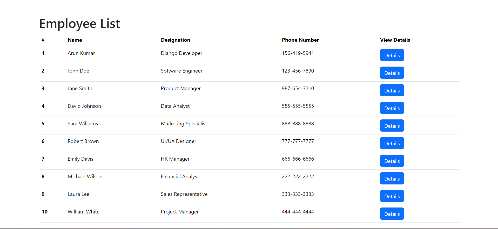

# Employee Directory Website

## Overview
This is a simple Django project that demonstrates how to work with URLs, templates, and models. The primary purpose of this project is to create a model called 'Employee' to store details of employees. It provides views for listing all employees and viewing individual employee details.

## Features
1. Home View:

    The home view of the project is implemented in the HomeView class. This view is used to display a list of all employees. Here is the code snippet for the HomeView:

    ```python
    class HomeView(generic.ListView):
        template_name = "index.html"
        context_object_name = "employee_list"

        def get_queryset(self):
            """
            Return the list of employees.
            """
            return Employee.objects.all()
    ```
    In the home view, users can see a list of all employees, making it easy to browse through the employee directory.

    

2. Employee Details View:

    The project also includes an employee details view, implemented in the EmployeeDetailView class. This view allows users to access the details of a specific employee. Here is the code snippet for the EmployeeDetailView:

    ```python
    class EmployeeDetailView(generic.DetailView):
        model = Employee
        template_name = 'details.html'
    ```
    The employee details view provides a dedicated page for each employee, displaying their specific information.

    

------------------------------------------------------------------------------------------------------------

### Getting Started

- Installation: Ensure you have Django installed. If not, you can install it using pip:
```
pip install Django
```

- Clone the Repository: Clone this project's repository to your local machine.

- Database Setup: Configure your database settings in the project's settings.py file. Run migrations to create the necessary database tables:
```
python manage.py makemigrations
python manage.py migrate
```

- Run the Development Server: Start the Django development server:
```
python manage.py runserver
```

- Access the Application: Open your web browser and navigate to http://127.0.0.1:8000/ to access the Employee Directory Website.

### Contributing
Contributions are welcome! If you would like to enhance or expand upon this project, please fork the repository and submit your pull requests.

### License
This project is open-source and available under the no License. Feel free to use, modify, and distribute it as needed.

### Contact
For any questions or feedback, please contact [Arun Kumar](mailto:arun.kumar.2403gg@gmail.com).